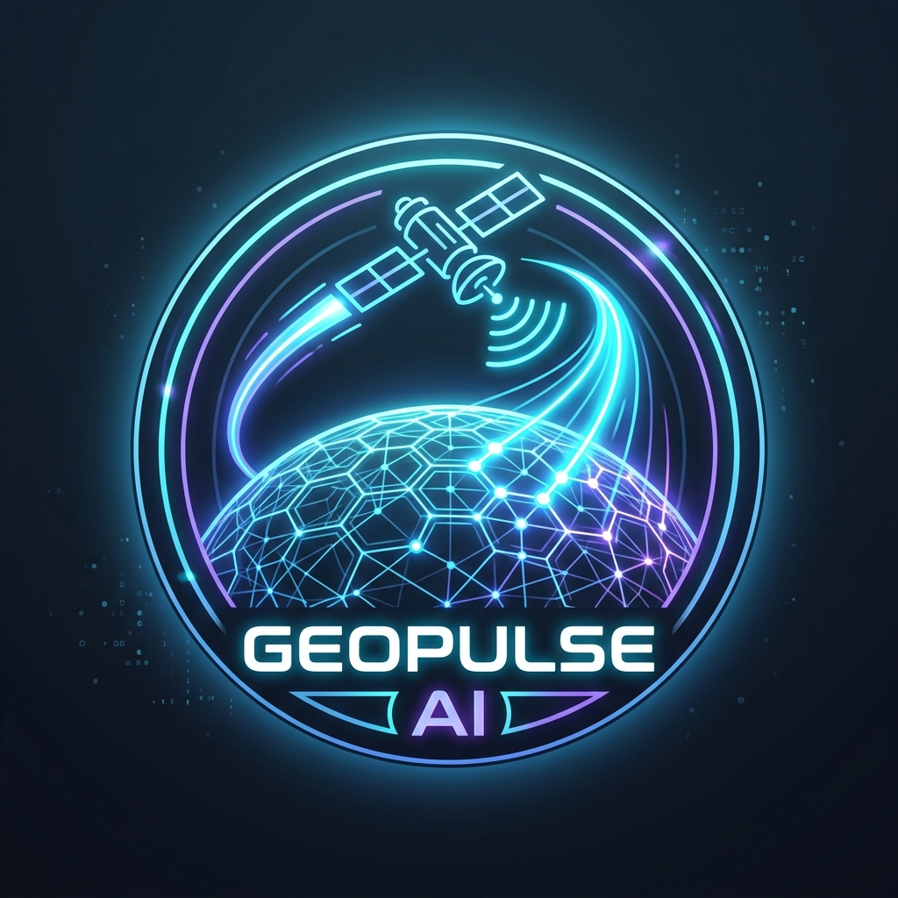

# AEGIS-ORBIT — Android + Web Platform
## FIAP Global Solution 2026

<p align="center">
  
</p>

<p align="center">
  <strong>Inteligência Climática por Satélite · Monitoramento Aeroespacial · Resposta a Desastres</strong><br>
  <em>Aplicativo Android Nativo + Dashboard Operacional Web (NASA EOS Partner)</em>
</p>

<p align="center">
  
  
  
  
</p>

---

## 📽️ Vídeo Pitch

> **Assista à demonstração completa do projeto:**
>
> 🎬 **[Aegis-Orbit: Monitoramento Climático Inteligente Via Satélite | Projeto Acadêmico](https://youtu.be/5WBFzDZWN7Y)**

---

## 👨‍🚀 Equipe

| RM | Nome |
|---|---|
| **563172** | Kalicon Amorim da Cruz Souza |

**Curso:** Análise e Desenvolvimento de Sistemas — FIAP  
**Disciplina:** Global Solution 2026  
**Turma:** 1ESPH

---

## 🌍 Sobre o Projeto

O **Aegis-Orbit** é um sistema integrado de monitoramento climático e aeroespacial que combina:

- **Dashboard Operacional Web** estilo NASA Mission Control com dados em tempo real
- **Aplicativo Android Nativo** (Kotlin + Jetpack Compose + WebView) com suporte NTN
- **APIs Reais Integradas**: NASA APOD, NASA NEO, ISS Tracker, SpaceX Launches, Open-Meteo, NOAA/SWPC
- **Módulo SkyWatch (UAP/SETI)**: Scanner ionosférico para detecção de anomalias aéreas
- **Sistema de Rotas de Fuga**: Mapa interativo (Leaflet.js + OpenStreetMap) com roteamento OSRM, abrigos e contatos de emergência
- **Eco-Créditos verdes** verificados por análise multiespectral óptica via satélite

---

## 🛰️ Funcionalidades

### Dashboard Principal (Sala de Telemetria)
- **Mapa EOS-HUD** com modos SAR Radar, Infravermelho TIRS, Óptico e SkyWatch
- **Hotspots interativos** de alerta (Rio-A: risco hidrológico, Norte-B: alerta térmico)
- **Rastreamento ISS em tempo real** via API pública
- **Monitor de Clima Espacial (NOAA/SWPC)**: vento solar, fluxo de prótons, atividade Kp
- **Hub Meteorológico Global**: temperatura, qualidade do ar, previsão 7 dias (Open-Meteo)
- **Alerta Defesa Civil SP**: simulação de nível de risco com sirenes de evasão

### Missão Aegis
- Infografia interativa da cadeia de valor espacial
- Diagrama animado dos satélites Sentinel/Landsat

### Simulador Android (Google Pixel)
- **Simulador completo** de smartphone com 5 telas funcionais:
  - Rotas de Fuga Offline (mapa SVG animado)
  - Reportar Ocorrência via uplink satelital LEO
  - Rastreamento de satélites LEO com alinhamento de antena
  - Aegis SkyWatch com radar giratório e blips de anomalia
  - Comunidade Verde (eco-créditos e gamificação)
- Terminal ADB emulado com comandos reais
- Loader de uplink satelital animado

### Observatório Espacial
- **NASA APOD** ao vivo com 4 modos de lente (H-Alpha, Gravitacional, Heliofísico)
- **SpaceX Launch Tracker** com countdown em tempo real
- **Fase da Lua** calculada localmente (canvas)
- **Asteroides NEO** (NASA JPL NeoWs API)
- **Decodificador SETI** com espectrograma de rádio animado
- Painel de avistamentos comunitários

### 🆘 Sistema de Rotas de Fuga (NOVO)
- **Mapa interativo** Leaflet.js + OpenStreetMap centralizado em São Paulo
- **8 pontos seguros mapeados**: HMLMB, Parque Trianon, Ibirapuera, Bombeiros, SAMU e outros
- **Roteamento automático** via OSRM (sem chave de API)
- **Geolocalização GPS** do dispositivo
- **Seleção de tipo de catástrofe**: Enchente, Incêndio, Deslizamento, Sismo
- **Contatos de emergência**: SAMU 192, Bombeiros 193, Defesa Civil 199, Polícia 190
- **Integração Google Maps**: abre rota de fuga diretamente no Maps
- **Link direto**: HMLMB — Hospital Maternidade Leonor Mendes de Barros

### Apresentação Acadêmica (7 slides)
- Slides editáveis com dados do aluno
- Exportação em Markdown
- Link do pitch YouTube integrado: youtu.be/5WBFzDZWN7Y

### ODS Alinhamento
- 5 Objetivos de Desenvolvimento Sustentável da ONU (9, 11, 13, 2, 8)

---

## 🏗️ Arquitetura

```
geopulse-ai/
├── index.html              # Dashboard Web principal (deploy direto)
├── css/
│   └── style.css           # Design system completo (dark mode, glassmorphism)
├── js/
│   └── main.js             # Toda a lógica: APIs, animações, interações, rotas de fuga
├── assets/
│   ├── logo.png            # Logo Aegis-Orbit
│   ├── background.png      # Background espacial
│   ├── telescope_obs.png   # Lente H-Alpha
│   ├── black_hole_obs.png  # Lente Gravitacional M87*
│   └── solar_flare_obs.png # Canal Heliofísico CME
└── android-app/            # Projeto Android Studio completo
    ├── settings.gradle.kts
    ├── build.gradle.kts
    └── app/
        ├── build.gradle.kts
        ├── proguard-rules.pro
        └── src/main/
            ├── AndroidManifest.xml   # Permissões: internet, localização, áudio
            ├── java/br/com/fiap/aegisorbit/
            │   └── MainActivity.kt   # WebView + Edge-to-Edge + GPS + Permissões
            ├── res/
            │   ├── values/
            │   │   ├── strings.xml
            │   │   └── themes.xml    # Tema escuro sem ActionBar
            │   └── drawable/
            └── assets/               # Cópia sincronizada do web app
                ├── index.html        # ← Sincronizado automaticamente
                ├── css/
                │   ├── style.css     # ← Sincronizado automaticamente
                │   └── android.css   # Override mobile (layout responsivo)
                ├── js/
                │   └── main.js       # ← Sincronizado automaticamente
                └── assets/           # Imagens e logos
```

---

## 🚀 Como Usar

### Versão Web (Desktop)
```bash
cd geopulse-ai
python3 -m http.server 8080
# Acesse http://localhost:8080
```

### Versão Android — Build do APK

**Pré-requisitos:** Android Studio (ou SDK) instalado

```bash
# Método 1 — Via Android Studio
# Abra android-app/ no Android Studio e pressione Run (Shift+F10)

# Método 2 — Via linha de comando (Gradle Wrapper)
cd geopulse-ai/android-app
chmod +x gradlew
./gradlew assembleDebug
# APK gerado em: app/build/outputs/apk/debug/app-debug.apk

# Instalar no dispositivo conectado via USB
adb install app/build/outputs/apk/debug/app-debug.apk
```

> **Requisitos mínimos Android:** API 26+ (Android 8.0 Oreo)

---

## 🔌 APIs Integradas (gratuitas / sem chave)

| API | Uso | Chave Necessária |
|---|---|---|
| **Open-Meteo** | Clima em tempo real, previsão 7 dias, qualidade do ar | ❌ Não |
| **NASA APOD** | Foto astronômica do dia | ✅ DEMO_KEY (inclusa) |
| **NASA NEO** | Asteroides próximos da Terra | ✅ DEMO_KEY (inclusa) |
| **Where the ISS at** | Posição real da ISS | ❌ Não |
| **SpaceX r/SpaceX API** | Próximos lançamentos | ❌ Não |
| **NOAA/SWPC** | Clima espacial | ❌ Não |
| **OpenStreetMap + OSRM** | Mapa interativo e roteamento de fuga | ❌ Não |
| **Web Geolocation API** | GPS do dispositivo para rotas de fuga | ❌ Não |

---

## 🎨 Stack Tecnológica

| Tecnologia | Uso |
|---|---|
| HTML5 + CSS3 | Estrutura e design do dashboard |
| JavaScript (ES6+) | Toda a lógica de negócio e integrações |
| Leaflet.js | Mapa interativo de rotas de fuga |
| OpenStreetMap | Tiles de mapa (gratuito) |
| OSRM | Roteamento inteligente de fuga |
| CSS Custom Properties | Design system com variáveis de cor e tipografia |
| SVG animado | Mapas, radares e visualizações |
| Canvas 2D | Espectrograma SETI, fase da lua, gráfico de risco |
| Web Speech API | Comandos de voz em português |
| Kotlin | MainActivity Android com Jetpack Compose |
| Android WebView | Renderização do app web no dispositivo |
| Room DB | (declarado para rotas offline futuras) |
| FontAwesome 6 | Iconografia completa |
| Google Fonts | Tipografia NASA-style (Inter, Rajdhani, JetBrains Mono) |

---

## 🌱 ODS da ONU Atendidos

| ODS | Descrição | Como Aegis-Orbit Atende |
|---|---|---|
| **ODS 9** | Indústria, Inovação e Infraestrutura | Nova infraestrutura civil via satélites LEO |
| **ODS 11** | Cidades e Comunidades Sustentáveis | Rotas de fuga offline e alertas precoces |
| **ODS 13** | Ação Climática | Monitoramento de GEE e adaptabilidade |
| **ODS 2** | Fome Zero | Monitoramento de safras por satélite óptico |
| **ODS 8** | Trabalho Decente e Crescimento | Eco-créditos de carbono verificados |

---

## 📄 Licença

Projeto acadêmico — FIAP Global Solution 2026. Todos os direitos reservados.

© 2026 Kalicon Amorim da Cruz Souza — RM 563172
